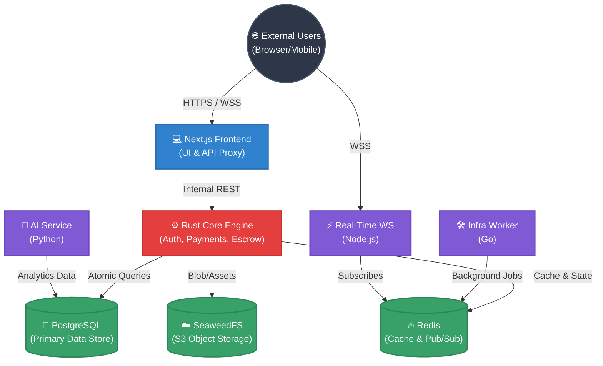

# CodeHaat — India's Digital Code Marketplace

  <picture>
    <source media="(prefers-color-scheme: light)" srcset="assets/banner.jpg">
    
  </picture>

  
  
  
  
  
  

> **⚠️ PROPRIETARY SOFTWARE** — This repository contains proprietary and confidential code owned by CodeHaat.
> Unauthorized copying, cloning, distribution, or use of this code is strictly prohibited and may result in legal action.
> See [LICENSE](LICENSE) for full terms.

---

## Table of Contents

- [Overview](#overview)
- [How It Works](#how-it-works)
- [Key Features](#key-features)
- [Tech Stack](#tech-stack)
- [Architecture](#architecture)
- [Service Responsibilities](#service-responsibilities)
- [Access & Security](#access--security)
- [Documentation](#documentation)
- [Contributors](#contributors)
- [License](#license)

---

## Overview

**CodeHaat** is India's premier digital code marketplace connecting developers who build production-grade code assets with businesses and developers who need them. Unlike traditional platforms that distribute static `.zip` archives, CodeHaat delivers purchased code directly to buyers' private GitHub repositories — providing a seamless, version-controlled experience from day one.

The platform is built on a highly optimized polyglot microservices architecture. It leverages the raw performance of Rust for its financial core, Next.js for a premium frontend experience, Go for background automation, Python for AI-driven recommendations, and Node.js for real-time WebSocket capabilities.

---

## How It Works

1. **Sellers Upload:** Developers upload their code repositories or link their private GitHub repos to the platform.
2. **Buyers Purchase:** Buyers browse the marketplace, review products, and purchase them securely via Razorpay (INR-native).
3. **Escrow Protection:** Funds are held in a secure database escrow for 7 days. If a dispute is raised, admins intervene. Otherwise, the funds are automatically released to the seller's wallet.
4. **Instant Delivery:** Upon successful payment, CodeHaat's background infrastructure automatically duplicates the purchased codebase into the buyer's GitHub account as a private repository.

---

## Key Features

| Feature | Description |
|---------|-------------|
| 🔐 **Secure Authentication** | JWT stored in HttpOnly cookies, Argon2 password hashing, GitHub OAuth, RBAC (user / developer / admin) |
| 💳 **Razorpay Payments** | INR-native payments, wallet top-ups, lowest platform commission (2.5%) |
| 🏦 **Seller Payouts** | Bank account & UPI withdrawal with 7-day escrow protection |
| 📦 **GitHub Delivery** | Code delivered as private repos — not `.zip` files |
| 🛡️ **Escrow System** | DB-enforced 7-day hold with PostgreSQL row-level locks |
| 🗄️ **Self-Hosted Storage** | SeaweedFS (S3-compatible) with presigned URL uploads |
| ⚡ **Real-Time Notifications** | WebSocket push via Redis pub/sub |
| 🤖 **AI Service** | FastAPI-powered search & personalized recommendations *(in development)* |

---

## Tech Stack

| Layer | Technology | Version | Purpose |
|-------|------------|---------|---------|
| **Frontend** | Next.js, React, TypeScript | Next.js 15 / React 19 | User interface, SSR, SEO |
| **Styling** | Tailwind CSS, shadcn/ui | Tailwind v4 | Design system |
| **Core API** | Rust, Actix-Web, SQLx | Rust ≥ 1.70 | API gateway, transactions, auth |
| **AI Service** | Python, FastAPI | Python 3.11+ | Recommendations, search |
| **Worker** | Go | Go 1.21+ | Background jobs, GitHub API |
| **Real-Time** | Node.js, ws | Node.js ≥ 20 | WebSocket notifications |
| **Database** | PostgreSQL | 16 | Primary data store |
| **Cache / Queue** | Redis | 7 | Job queues, cache, pub/sub |
| **Object Storage** | SeaweedFS | 3.76 | S3-compatible media storage |

---

## Architecture

The system operates across highly isolated microservices that communicate through strict internal bridges. 

---

## Service Responsibilities

To maintain a secure, decoupled ecosystem, each service acts independently within the private cluster.

| Service | Technology Focus | Core Responsibility |
|---------|------------------|---------------------|
| **Frontend** | TypeScript / Next.js | Serves as the public-facing application and Secure API Proxy. Manages HttpOnly cookies to defend against XSS. |
| **Core Engine** | Rust / Actix-Web | The heart of the platform. Handles JWT verification, wallet logic, escrow logic, product management, and high-stakes database transactions safely. |
| **AI Service** | Python / FastAPI | Powers intelligent marketplace features, including semantic search, product recommendations, and fraud detection signals. |
| **Infra Worker** | Go | Handles long-running background tasks securely, including interacting with the GitHub API to automate repository duplication for buyers. |
| **Real-Time** | Node.js / ws | Dedicated WebSocket handler. Listens to internal Redis Pub/Sub channels to push real-time notifications to users globally. |

---

## Access & Security

CodeHaat is designed **security-first** across every layer of the stack. 

### Network Topology & Access
To prevent external tampering, the platform utilizes strict network segmentation:
- **Public Entry Points:** Only the main web interface (Next.js proxy) and WebSocket endpoints are exposed securely via a Reverse Proxy.
- **Internal Microservices:** All backend services (Rust Core, AI, Go Worker, etc.) operate exclusively on an **isolated, internal Docker bridge network**. They are entirely invisible to the public internet and can only be accessed through authorized internal routing.
- **Database/Cache Isolation:** PostgreSQL, Redis, and SeaweedFS instances do not expose their connection protocols outside the internal container network. 

### Security Mitigations
| Mechanism | Implementation |
|-----------|----------------|
| **Password Hashing** | Argon2 (memory-hard, GPU/ASIC-resistant) |
| **Token Storage** | JWT in HttpOnly cookies — never readable by browser JS |
| **SQL Injection** | Impossible — SQLx enforces compile-time parameterised queries |
| **Rate Limiting** | Strict DoS mitigation on auth, uploads, and verification endpoints |
| **Payment Integrity** | HMAC-SHA256 + constant-time comparison for Razorpay webhooks |
| **Financial Escrow** | 7-day hold enforced at the database level with atomic `FOR UPDATE` row locks |

To report a security vulnerability, please email **security@codehaat.com**. See [SECURITY](SECURITY) for our responsible disclosure policy.

---

## Documentation

| Document | Description |
|----------|-------------|
| [API_REFERENCE.md](API_REFERENCE.md) | Full REST API documentation |
| [SECURITY](SECURITY) | Detailed security architecture & threat mitigations |
| [CHANGE.md](CHANGE.md) | Project changelog |
| [CONTRIBUTING.md](CONTRIBUTING.md) | Core team & contributors |

---

## Contributors

---

## License

This project is **proprietary software** owned by CodeHaat. All rights reserved.

- Unauthorized copying, cloning, or distribution is **strictly prohibited**
- See [LICENSE](LICENSE) for the complete license agreement
- Licensing inquiries: **legal@codehaat.com**

---

Built with passion for the Indian developer community 🇮🇳
