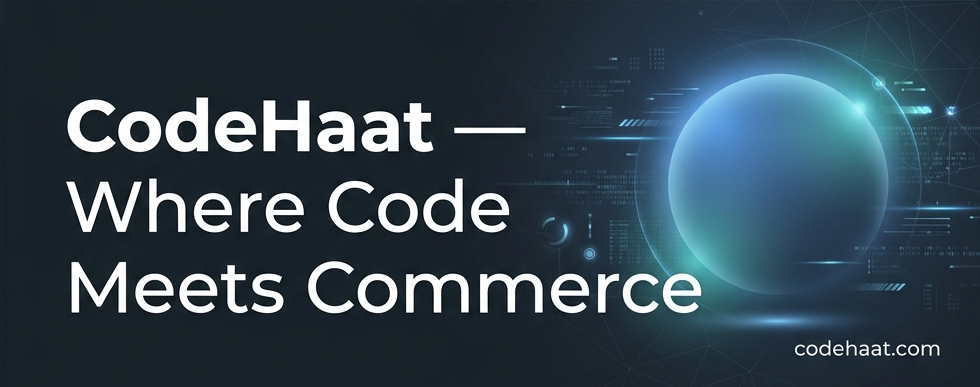

# CodeHaat — India's Digital Code Marketplace

<p align="center">
  <picture>
    <source media="(prefers-color-scheme: light)" srcset="assets/banner.jpg">
    
  </picture>
</p>

<p align="center">
  <a href="https://github.com/Devshakya19/CodeHaat/actions"></a>
  <a href="https://github.com/Devshakya19/CodeHaat/blob/main/LICENSE"></a>
  <a href="https://nodejs.org/en"></a>
  <a href="https://www.rust-lang.org/"></a>
  <a href="https://docs.docker.com/"></a>
  
</p>

> **⚠️ PROPRIETARY SOFTWARE** — This repository contains proprietary and confidential code owned by CodeHaat.
> Unauthorized copying, cloning, distribution, or use of this code is strictly prohibited and may result in legal action.
> See [LICENSE](LICENSE) for full terms.

---

## Table of Contents

- [Overview](#overview)
- [Key Features](#key-features)
- [Tech Stack](#tech-stack)
- [Architecture](#architecture)
- [Project Structure](#project-structure)
- [Quick Start](#quick-start)
- [Service Reference](#service-reference)
- [Security](#security)
- [Documentation](#documentation)
- [Development](#development)
- [Contributors](#contributors)
- [License](#license)

---

## Overview

**CodeHaat** is India's premier digital code marketplace connecting developers who build production-grade code assets with businesses and developers who need them. Unlike traditional platforms that distribute static `.zip` archives, CodeHaat delivers purchased code directly to buyers' private GitHub repositories — providing a seamless, version-controlled experience from day one.

The platform is built on a polyglot microservices architecture: Rust handles the performance-critical core API and financial transactions, Next.js delivers a premium frontend experience, Go powers background automation, Python drives AI recommendations, and Node.js manages real-time WebSocket notifications.

---

## Key Features

| Feature | Description |
|---------|-------------|
| 🔐 **Secure Authentication** | JWT stored in HttpOnly cookies, Argon2 password hashing, GitHub OAuth, RBAC (user / developer / admin) |
| 💳 **Razorpay Payments** | INR-native payments, wallet top-ups, lowest platform commission (2.5%) |
| 🏦 **Seller Payouts** | Bank account & UPI withdrawal with 7-day escrow protection |
| 📦 **GitHub Delivery** | Code delivered as private repos — not `.zip` files |
| 🛡️ **Escrow System** | DB-enforced 7-day hold with PostgreSQL row-level locks |
| 🗄️ **Self-Hosted Storage** | SeaweedFS (S3-compatible) with presigned URL uploads |
| ⚡ **Real-Time Notifications** | WebSocket push via Redis pub/sub |
| 🤖 **AI Service** | FastAPI-powered search & personalized recommendations *(in development)* |

---

## Tech Stack

| Layer | Technology | Version | Purpose |
|-------|------------|---------|---------|
| **Frontend** | Next.js, React, TypeScript | Next.js 15 / React 19 | User interface, SSR, SEO |
| **Styling** | Tailwind CSS, shadcn/ui | Tailwind v4 | Design system |
| **Core API** | Rust, Actix-Web, SQLx | Rust ≥ 1.70 | API gateway, transactions, auth |
| **AI Service** | Python, FastAPI | Python 3.11+ | Recommendations, search |
| **Worker** | Go | Go 1.21+ | Background jobs, GitHub API |
| **Real-Time** | Node.js, ws | Node.js ≥ 20 | WebSocket notifications |
| **Database** | PostgreSQL | 16 | Primary data store |
| **Cache / Queue** | Redis | 7 | Job queues, cache, pub/sub |
| **Object Storage** | SeaweedFS | 3.76 | S3-compatible media storage |
| **Auth** | JWT (HS256), Argon2 | — | Stateless auth, password hashing |
| **Payments** | Razorpay | — | INR payments, webhooks, escrow |
| **Container** | Docker, Docker Compose | ≥ 24.0 | Orchestration (8 services) |

---

## Architecture

```
┌──────────────────────────────────────────────────────────────┐
│                        USERS (Browser)                       │
└──────────────────────────┬───────────────────────────────────┘
                           │  HTTPS · HttpOnly Cookies
                           ▼
┌──────────────────────────────────────────────────────────────┐
│               1. Frontend  ·  Next.js  :3000                 │
│  Pure UI + API proxy layer · No direct database access       │
│  JWT stored in HttpOnly cookies (XSS-proof)                  │
└──────────────────────────┬───────────────────────────────────┘
                           │  REST (Bearer token)
                           ▼
┌──────────────────────────────────────────────────────────────┐
│              2. Core Engine  ·  Rust  :4001                  │
│  Auth · Products · Orders · Wallet · Payments · Payouts      │
│  PostgreSQL transactions with FOR UPDATE row-level locks     │
└──────┬──────────────┬──────────────────┬─────────────────────┘
       │              │                  │
       ▼              ▼                  ▼
┌────────────┐ ┌────────────┐ ┌───────────────────────────┐
│ PostgreSQL │ │   Redis    │ │  SeaweedFS S3  :8333      │
│  16  (DB)  │ │ 7  (cache) │ │  products/  · avatars/    │
└────────────┘ └──────┬─────┘ └───────────────────────────┘
                      │  pub/sub
          ┌───────────┼─────────────┐
          ▼           ▼             ▼
  ┌─────────────┐ ┌──────────┐ ┌──────────────┐
  │  3. AI Svc  │ │ 4.Worker │ │ 5. Real-Time │
  │  Python     │ │   Go     │ │  Node.js WS  │
  └─────────────┘ └──────────┘ └──────────────┘
```

### Service Responsibilities

| # | Service | Language | Port | Role |
|---|---------|----------|------|------|
| 1 | **Frontend** | TypeScript / Next.js | `3000` | SSR UI, API proxy, auth cookie management |
| 2 | **Core Engine** | Rust / Actix-Web | `4001` | JWT verification, wallet, escrow, transactions |
| 3 | **AI Service** | Python / FastAPI | `4002` | Recommendations, semantic search, fraud signals |
| 4 | **Infra Worker** | Go | `4003` | GitHub repo delivery, background jobs |
| 5 | **Real-Time** | Node.js / ws | `4004` | WebSocket connections, Redis pub/sub relay |

---

## Project Structure

```
CodeHaat/
├── apps/
│   └── web/                          # Next.js frontend (App Router)
│       └── src/
│           ├── features/             # Feature-sliced modules
│           │   ├── auth/             # Authentication pages
│           │   ├── browse/           # Buyer marketplace
│           │   ├── products/         # Product detail
│           │   ├── seller/           # Seller dashboard & earnings
│           │   ├── wallet/           # Wallet & payout UI
│           │   ├── landing/          # Marketing landing page
│           │   ├── developer/        # Seller onboarding
│           │   └── pages/            # Company & legal pages
│           ├── shared/               # Shared components, UI, utils
│           └── app/                  # Next.js routes & API proxy
│
├── services/
│   ├── core-engine/                  # Rust API gateway (Actix-Web)
│   ├── ai-service/                   # Python AI service (FastAPI)
│   ├── infra-worker/                 # Go background worker
│   └── realtime-service/             # Node.js WebSocket server
│
├── sql/
│   └── 01-schema.sql                 # PostgreSQL schema (13 tables)
│
├── config/
│   └── seaweedfs/                    # SeaweedFS S3 configuration
│
├── docs/                             # In-depth documentation
│   ├── 01-PRD.md                     # Product Requirements
│   ├── 02-ARCHITECTURE.md            # System Architecture
│   ├── 03-RULES.md                   # Coding Conventions
│   ├── 04-DESIGN.md                  # UI/UX Design System
│   ├── 05-TRD.md                     # Technical Requirements
│   ├── 06-APP-FLOW.md                # User Flows
│   ├── 07-BACKEND.md                 # Backend & Schema Reference
│   ├── 08-PRESENTATION.md            # Investor / Company Deck
│   └── foundation/                   # Terms, Policies, Legal
│
├── assets/                           # Brand assets & images
├── scripts/                          # Utility scripts
├── docker-compose.yml                # Docker orchestration (8 services)
├── setup.sh                          # Environment bootstrap script
└── .env.example                      # Environment variable template
```

---

## Quick Start

### Prerequisites

| Tool | Minimum Version | Purpose |
|------|----------------|---------|
| Docker & Docker Compose | 24.0+ | Container orchestration |
| Node.js | 20.x+ | Frontend local dev |
| Rust toolchain | 1.70+ | Backend local dev |
| Git | 2.x+ | Source control |

### 1. Clone the Repository

```bash
git clone https://github.com/Devshakya19/CodeHaat.git
cd CodeHaat
```

### 2. Bootstrap the Environment

The `setup.sh` script auto-generates cryptographically secure secrets and environment files in one step:

```bash
chmod +x setup.sh
./setup.sh
```

Or configure manually by copying and editing each `.env.example`:

```bash
# Root environment (shared secrets)
cp .env.example .env

# Per-service environment files
cp services/core-engine/.env.example  services/core-engine/.env
cp services/ai-service/.env.example   services/ai-service/.env
cp services/infra-worker/.env.example services/infra-worker/.env
cp services/realtime-service/.env.example services/realtime-service/.env

# SeaweedFS S3 configuration
cp config/seaweedfs/s3.json.example config/seaweedfs/s3.json

# Fill in RAZORPAY_KEY_ID, RAZORPAY_KEY_SECRET, RAZORPAY_WEBHOOK_SECRET,
# GITHUB_CLIENT_ID, GITHUB_CLIENT_SECRET, and change JWT_SECRET in production.
```

### 3. Start All Services

```bash
# Build images and start all 8 services in the background
docker compose up -d

# Monitor container health
docker compose ps

# Stream logs from all services
docker compose logs -f

# Run the smoke-test suite
./test-docker.sh
```

> PostgreSQL automatically provisions the full schema on first run via `sql/01-schema.sql`.

### 4. Access the Services

| Service | URL / Address | Visibility |
|---------|--------------|-----------|
| **Frontend** | http://localhost:3000 | Public |
| **Core Engine (REST)** | http://localhost:4001 | Public |
| **AI Service** | http://localhost:4002 | Internal |
| **Infra Worker** | *(no HTTP interface)* | Internal |
| **Real-Time (WS)** | ws://localhost:4004 | Internal |
| **PostgreSQL** | localhost:5432 | Internal |
| **Redis** | localhost:6379 | Internal |
| **SeaweedFS S3** | http://localhost:8333 | Internal |
| **SeaweedFS Filer** | http://localhost:8888 | Internal |

---

## Security

CodeHaat is designed **security-first** across every layer of the stack. Below is a high-level summary; see [SECURITY](SECURITY) for the full technical breakdown.

| Layer | Mechanism |
|-------|-----------|
| **Password Hashing** | Argon2 (memory-hard, GPU/ASIC-resistant) |
| **Token Storage** | JWT in HttpOnly cookies — never readable by browser JS |
| **SQL Injection** | Impossible — SQLx enforces compile-time parameterised queries |
| **Rate Limiting** | Per-endpoint: auth (5/12 s), uploads (10/6 s), verification (10/6 s) |
| **SSRF Protection** | Allowlist-based URL validation on all proxy & upload routes |
| **CORS** | Dynamic, env-configurable per-origin policy |
| **Security Headers** | `X-Frame-Options`, `X-XSS-Protection`, `X-Content-Type-Options`, `Cache-Control` |
| **Payment Integrity** | HMAC-SHA256 + constant-time comparison for Razorpay webhooks |
| **Escrow** | 7-day hold enforced at the database level with `FOR UPDATE` row locks |
| **Sensitive Data** | Bank account numbers masked in all API responses (last 4 digits only) |
| **Network Isolation** | Internal services run on an isolated Docker bridge network |

To report a security vulnerability, please email **security@codehaat.com**. See [SECURITY](SECURITY) for our responsible disclosure policy.

---

## Documentation

| Document | Description |
|----------|-------------|
| [ONBOARDING.md](ONBOARDING.md) | Step-by-step setup guide for new developers |
| [TROUBLESHOOTING.md](TROUBLESHOOTING.md) | Common issues and their solutions |
| [API_REFERENCE.md](API_REFERENCE.md) | Full REST API documentation |
| [SECURITY](SECURITY) | Detailed security architecture & threat mitigations |
| [CHANGE.md](CHANGE.md) | Project changelog |
| [CONTRIBUTING.md](CONTRIBUTING.md) | Core team & contributors |
| [docs/01-PRD.md](docs/01-PRD.md) | Product Requirements Document |
| [docs/02-ARCHITECTURE.md](docs/02-ARCHITECTURE.md) | System Architecture |
| [docs/03-RULES.md](docs/03-RULES.md) | Engineering Rules & Conventions |
| [docs/04-DESIGN.md](docs/04-DESIGN.md) | UI/UX Design System |
| [docs/05-TRD.md](docs/05-TRD.md) | Technical Requirements Document |
| [docs/06-APP-FLOW.md](docs/06-APP-FLOW.md) | Application & User Flows |
| [docs/07-BACKEND.md](docs/07-BACKEND.md) | Backend Architecture & Schema |
| [docs/08-PRESENTATION.md](docs/08-PRESENTATION.md) | Investor / Company Presentation |

---

## Development

### Running Services Locally (without Docker)

```bash
# Frontend — Next.js dev server
cd apps/web
npm install
npm run dev          # Starts on http://localhost:3001

# Core Engine — Rust (requires Rust toolchain)
cd services/core-engine
cargo run            # Starts on http://localhost:4001
```

### Docker Workflow

```bash
docker compose up -d            # Start all services
docker compose up -d --build    # Rebuild images after code changes
docker compose logs -f          # Stream logs
docker compose down             # Stop and remove containers
docker compose down -v          # Stop and remove containers + volumes
```

### Code Quality

```bash
# Frontend
cd apps/web && npm run lint && npm run build

# Rust backend
cd services/core-engine && cargo clippy && cargo test

# Dependency vulnerability scanning
cargo audit                      # Rust
npm audit                        # Node.js
```

---

## Contributors

<table>
  <tr>
    <td align="center">
      <a href="https://github.com/Devshakya19">
        <br/>
        <sub><b>Dev Shakya</b></sub>
      </a><br/>
      <sub>Founder · Lead Engineer</sub>
    </td>
    <td align="center">
      <a href="https://github.com/Deekshajain28">
        <br/>
        <sub><b>Deeksha Jain</b></sub>
      </a><br/>
      <sub>Marketing</sub>
    </td>
  </tr>
</table>

---

## License

This project is **proprietary software** owned by CodeHaat. All rights reserved.

- Unauthorized copying, cloning, or distribution is **strictly prohibited**
- See [LICENSE](LICENSE) for the complete license agreement
- Licensing inquiries: **legal@codehaat.com**

---

<p align="center">Built with passion for the Indian developer community 🇮🇳</p>